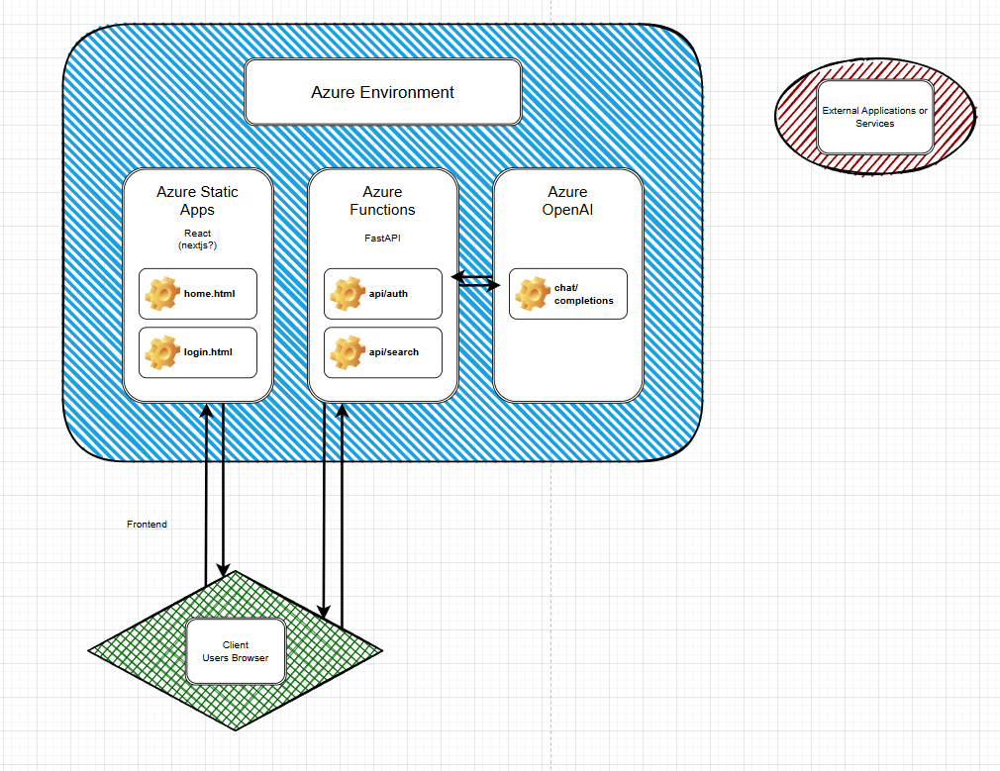

# Project Root

## Links

- [Static React App](https://red-coast-03918001e.5.azurestaticapps.net)
- [FastAPI App on Azure Functions](https://my-fastapi-function.azurewebsites.net/api/hello)

# Project Structure

- `.github/`
  - `workflows/` - CI/CD pipeline definitions
- `docs/` - Project documentation
- `infrastructure/` - IaC templates (e.g., Terraform, ARM)
  - `modules/` - Reusable infrastructure modules
  - `environments/` - Environment-specific configurations
- `src/`
  - `backend/` - FastAPI application
    - `app/`
      - `api/` - API routes
      - `core/` - Core application code
      - `models/` - Data models
      - `services/` - Business logic services
    - `tests/` - Backend tests
    - `requirements.txt` - Python dependencies
  - `frontend/` - React or Next.js application
    - `src/` - React or Next.js application
      - `components/` - React components
      - `pages/` - Next.js pages (if using Next.js)
      - `public/` - Static assets
    - `package.json` - Node.js dependencies
- `.gitignore`
- `README.md`
- `LICENSE`

# Azure FastAPI Serverless Project

## Overview

This project implements a serverless application using FastAPI deployed on Azure Functions, with a React/Next.js frontend. The entire infrastructure is set up within a private network using Azure services.

## Project Structure

- `/.github/workflows/`: CI/CD pipeline definitions
- `/docs/`: Project documentation
- `/infrastructure/`: Infrastructure as Code (IaC) templates
- `/src/`: Source code for backend and frontend

## Key Components

1. Backend: FastAPI application deployed as Azure Functions
2. Frontend: React/Next.js application hosted on Azure Static Web Apps
3. Authentication: Azure Active Directory (AD) integration
4. Networking: Private Virtual Network with private endpoints
5. API Management: Azure API Management as a gateway

## Getting Started

1. Clone this repository
2. Set up Azure CLI and login to your Azure account
3. Navigate to `/infrastructure` and follow the README to set up the Azure resources
4. Set up the backend by following the README in `/src/backend`
5. Set up the frontend by following the README in `/src/frontend`

## Development Workflow

1. Make changes in the respective `/src` subdirectories
2. Test locally using the provided scripts in `/scripts`
3. Commit changes and push to trigger the CI/CD pipeline

## Deployment

Deployment is handled automatically by the CI/CD pipeline defined in `/.github/workflows/`. Manual deployment steps, if needed, are documented in the respective component READMEs.

## Contributing

Please read `CONTRIBUTING.md` for details on our code of conduct and the process for submitting pull requests.

## License

This project is licensed under the MIT License - see the `LICENSE` file for details.

# status

- done

  - basic react app done
  - created resource group, and static app service
  - successfully got the react app deployed to the static app service
  - setup all the IaC for the rg and static app stuff
  - basic fastapi backend
  - create azure function resource
  - deploy fastapi to functions

- todo
  - setup IaC for azure functions
